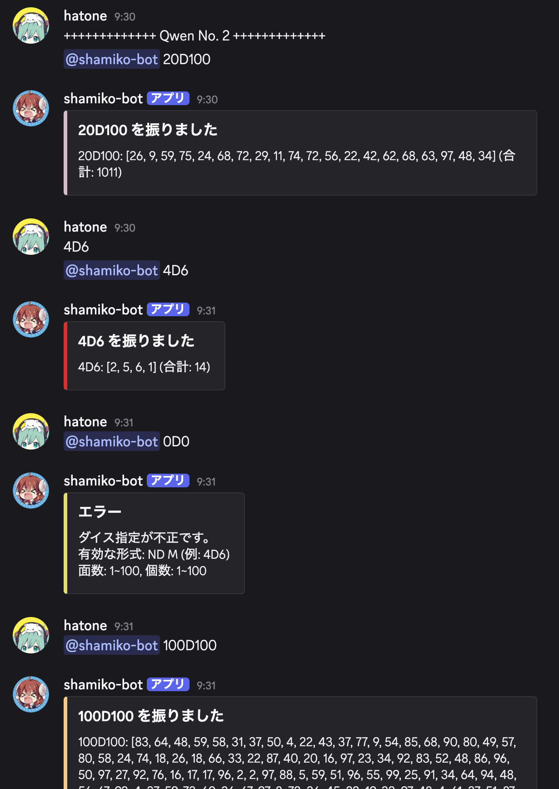

# Qwen 3.5 on Claude Code による Discord ダイスボット

[Qwen3.6-35B-A3B-UD-MLX-4bit](https://huggingface.co/unsloth/Qwen3.6-35B-A3B-UD-MLX-4bit) をローカルLLMとして使用し Claude Code を動かした。

指示は以下の通りおこない、その後の修正はおこなっていない。

```
Discord bot を作りたいです。Go言語です。
ダイスロールの結果を返すbotです。

例えば「4D6」のようにメンションされると、6面ダイスを4個振った結果を返します。
「2D100」のようにメンションされると、100面ダイスを2個振った結果を返します。

ダイスの面数は1~100までの整数、ダイスの個数は1~100までの整数で、
それ以外を指定された場合はエラーメッセージを返すようにしたいです。

コーディングルールは ~/Programs/.editorconfig を参照してください。
コードは必ず go fmt で整形してください。
```

調子が良かったので、その後 `/init` をおこない `CLAUDE.md` を作成してもらい、  
さらに「README.md を日本語で記述してください」と指示して `README.md` を作成してもらった。（このレポートを書くため `qwen-README.md` にファイルは移動）

README の作成に関しては、コンテキストがすでに多かったようで Compact がおこなわれ、  
Claude Code のログによれば 6m 43s もかかった様子。

## 良かった点

- 正常に動いた！
- コーディングも詰まることなくすぐに完了した

## 悪かった点

- `main.go` にすべての実装を書いており、ロジックを別ファイルに分けていない

### やり取りの様子


